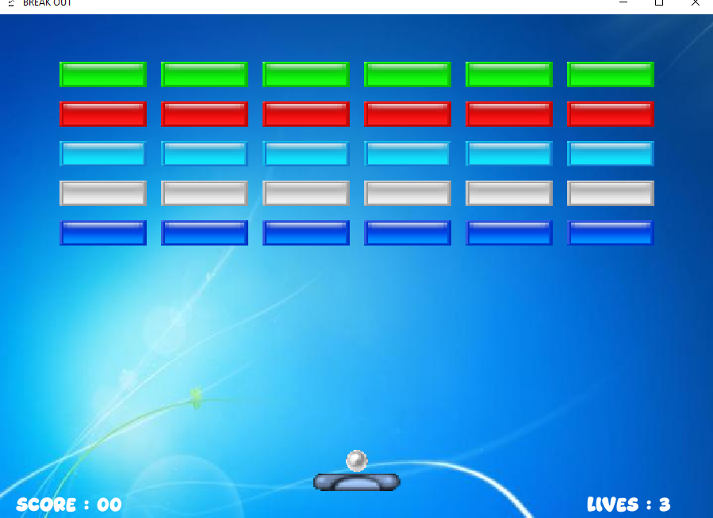
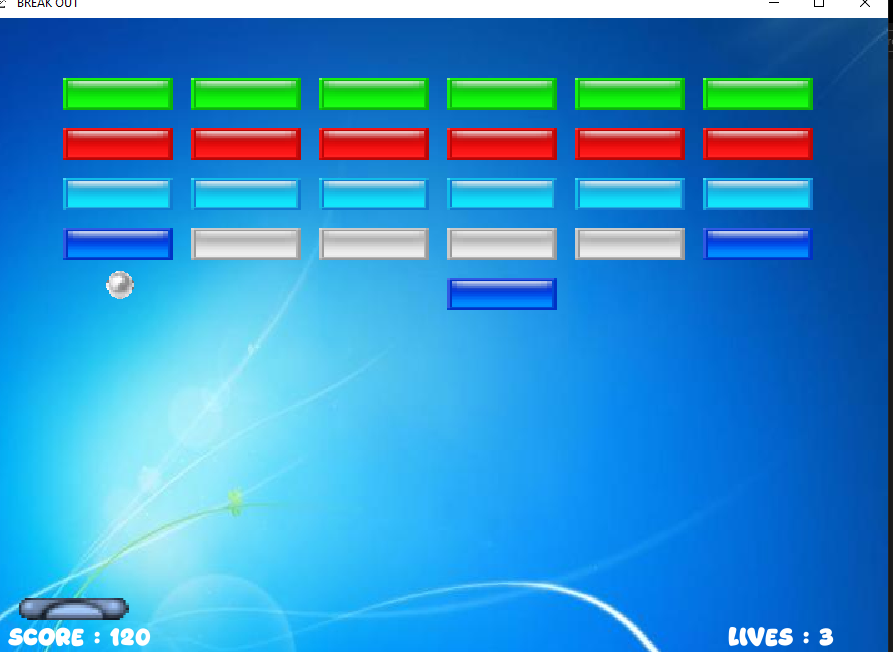

# 🧱 Breakout

### A classic brick-breaking arcade game built with **C++** and **SFML**

---

## 📖 About

**Breakout** is a recreation of the timeless brick-breaking arcade classic. Control a paddle to bounce a ball into a wall of bricks, breaking them one by one while keeping the ball from falling past your paddle. Simple to learn, satisfying to master.

---

## 🎮 Controls

| Key | Action |
|-----|--------|
| **A** | Move paddle left |
| **D** | Move paddle right |
| **Space** | Release the ball from the paddle |

---

## 🖼 Screenshots

---

## 🛠 Built With

- **C++** — core game logic
- **SFML** — graphics rendering, window management, and input handling

---

## ✨ Features

- Smooth paddle and ball movement
- Real-time collision detection between ball, paddle, and bricks
- Brick-breaking mechanics with score tracking
- Simple, responsive controls

---

## ▶️ How to Run

1. Make sure **SFML** is installed and linked in your build environment.
2. Compile `breakout.cpp` with your C++ compiler, linking against SFML.
3. Run the generated executable.
4. Press **Space** to launch the ball, and use **A** / **D** to control the paddle.

---

## 📌 Notes

This project is part of a larger collection of C++/SFML games — check out the [main Games repository](../../) for more.