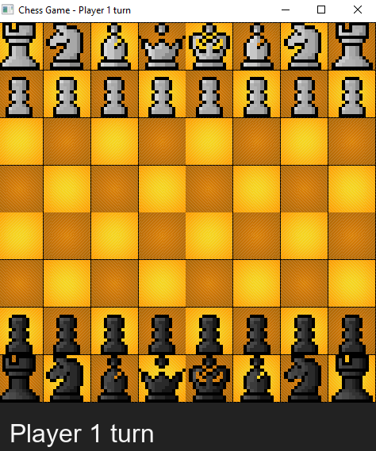
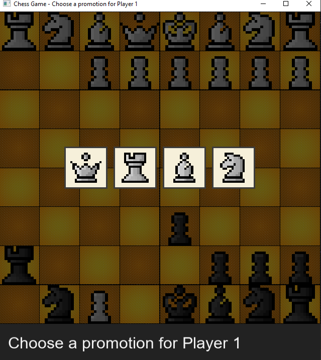

<div align="center">

# ♟️ Chess

### *Every move matters.*

**A complete implementation of the world's oldest strategy game**, built from the ground up in **C++** and **SFML**


</div>

---

<div align="center">

### ♜ ♞ ♝ ♛ ♚ ♝ ♞ ♜
*A battle of sixty-four squares, thirty-two pieces, and infinite possibilities.*

</div>

---

## 📖 About

**Chess** isn't just a recreation — it's a full, rules-accurate engine built to respect every nuance of the original game. No shortcuts, no simplified logic: every legal move is validated, every illegal move is rejected, and the game faithfully enforces check, checkmate, and turn order exactly as the real game demands.

This project was built to answer one question: *what does it actually take to encode the full complexity of chess into working software?*

---

## 🖱️ Controls

| Action | Input |
|--------|-------|
| **Select & move a piece** | Left Click |

Simple on the surface — but every click is validated against the full rule set of chess underneath.

---

## 👑 Rules Enforced

- ✅ **Legal move validation** for every piece type — pawns, knights, bishops, rooks, queens, and kings all move exactly as the real game dictates
- 🚫 **Illegal moves are rejected outright** — you cannot move a piece anywhere the rules of chess don't allow
- ⚠️ **Check detection** — the game recognizes when a king is under threat
- ☠️ **Checkmate detection** — the game correctly identifies when there's no escape
- 🔄 **Turn-based enforcement** — players can only move their own pieces, strictly alternating turns

---

## 🖼 Screenshots

<div align="center">




</div>

---

## 🛠 Built With

- **C++** — full game logic, rule enforcement, and board state management
- **SFML** — rendering the board, pieces, and handling mouse input

---

## 🏗 Project Structure

```text
Chess/
│
├── *.cpp          → source files
├── *.h            → header files
├── assets/
├── screenshots/
└── README.md
```

Given the scope of a full chess engine, the logic is split across multiple `.cpp`/`.h` files by responsibility (board, pieces, game rules, rendering, etc.) rather than a single monolithic file — even though they currently sit together at the project root.

---

## ▶️ How to Run

1. Make sure **SFML** is installed and linked in your build environment.
2. Compile all source files in `src/`, with headers resolved from `include/`, linking against SFML.
3. Run the generated executable.
4. **Left-click** a piece to select it, then left-click a destination square to move. The game will only allow legal moves.

---

## 📌 Notes

This project is part of a larger collection of C++/SFML games — check out the [main Games repository](../../) for more.

<div align="center">

*"Chess is the gymnasium of the mind." — Blaise Pascal*

</div>