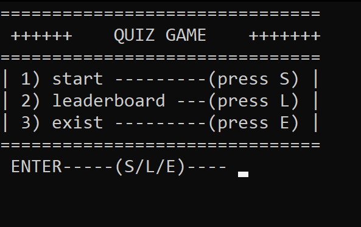
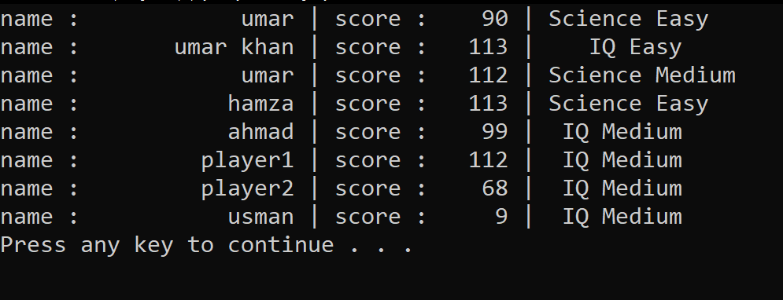
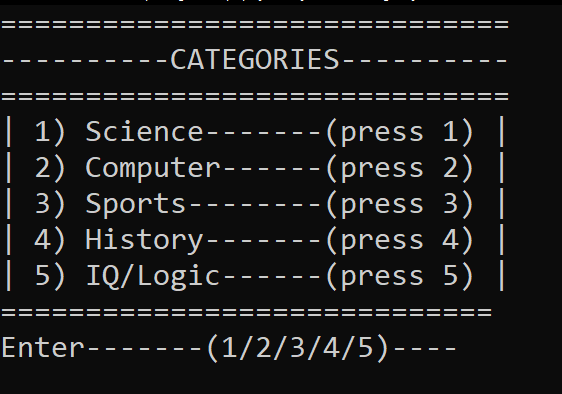
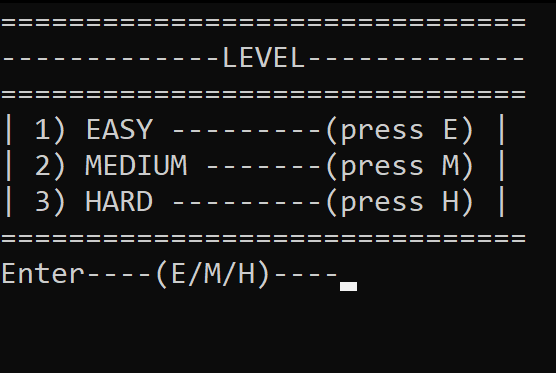
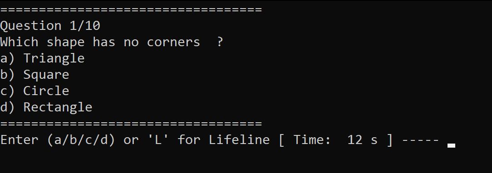
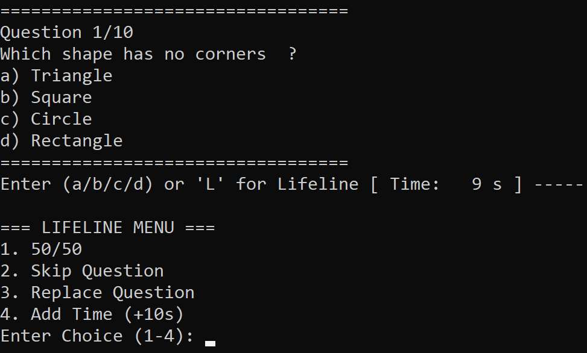

# 📝 Console Quiz Game

### A file-based, time-driven quiz application built with **C++**

---

## 📖 About

**Console Quiz Game** is a timed, subject-based quiz application where every second counts. Choose your subject, pick your difficulty, and race against the clock to answer 10 questions — with lifelines to help you when you're stuck.

---

## ✨ Features

- 📚 **Multiple subjects** to choose from
- 🎚 **Three difficulty modes** — Easy, Medium, Hard
- ⏱ **Time-based gameplay** — 15 seconds per question, 10 questions per round
- ❤️ **Lifelines** to help you survive tricky questions
- 🏆 **Leaderboard** with persistent score tracking
- 💾 File-based data storage for scores and quiz content

---

## 🖼 Screenshots

  

  

| Screenshot | Description |
|------------|-------------|
| 1 | Main menu |
| 2 | Leaderboard |
| 3 | Subject selection |
| 4 | Difficulty selection — Easy, Medium, Hard |
| 5 | Quiz in progress |
| 6 | Lifeline usage during the game |

---

## 🎯 How It Works

1. **Choose a subject** from the available quiz categories.
2. **Select a difficulty** — Easy, Medium, or Hard — to set the challenge level.
3. **Answer 10 questions**, each with a **15-second timer**.
4. Use your **lifelines** wisely when a question stumps you.
5. Finish the round and see your score placed on the **leaderboard**.

---

## 🛠 Built With

- **C++** — core application logic
- **File Handling** — persistent leaderboard and quiz data storage

---

## 📌 Notes

This project is part of a larger collection of C++ games — check out the [main Games repository](../../) for more.