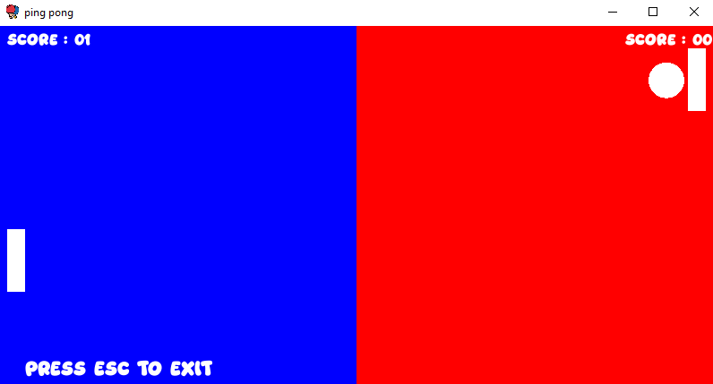
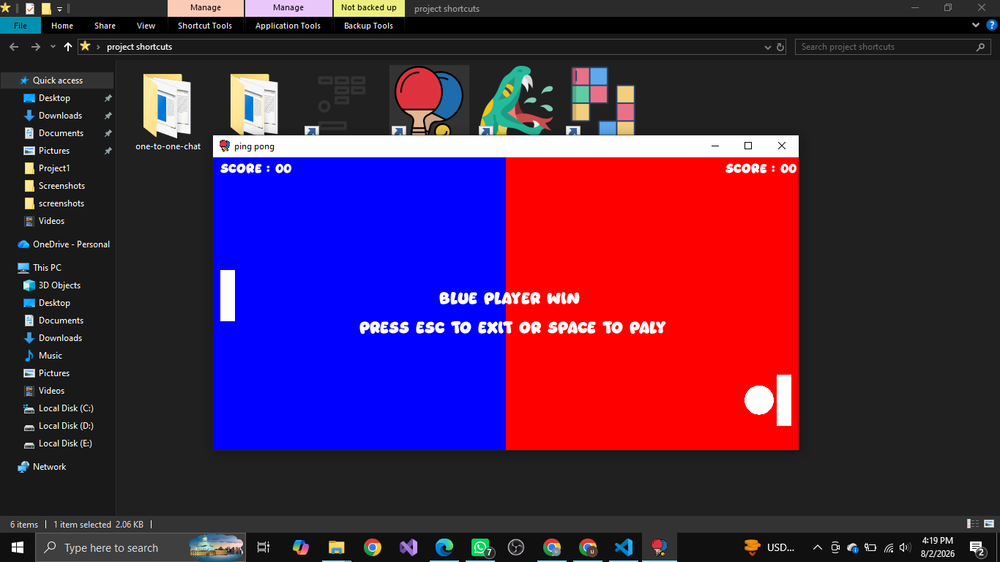

# 🏓 Ping Pong

### A modern recreation of the classic arcade game, built with **C++** and **SFML**

---

## 📖 About

**Ping Pong** brings the timeless two-player arcade classic to life. Rally the ball back and forth, outmaneuver your opponent, and be the first to reach **5 points** to claim victory — all set to background music for that extra arcade feel.

---

## 🎮 Controls

| Player | Key | Action |
|--------|-----|--------|
| **Player 1** | `W` | Move paddle up |
| **Player 1** | `S` | Move paddle down |
| **Player 2** | `↑ (Up Arrow)` | Move paddle up |
| **Player 2** | `↓ (Down Arrow)` | Move paddle down |
| **Both** | `ESCAPE` | Exit the game |

---

## 🖼 Screenshots

---

## 🏆 Game Rules

- Two players face off, each controlling a paddle on their side of the screen.
- The ball bounces between paddles — miss it, and your opponent scores.
- 🥇 **First player to reach 5 points wins the match.**
- 🎵 Background music plays throughout, adding to the classic arcade atmosphere.

---

## ✨ Features

- Local two-player gameplay on a single keyboard
- Real-time paddle and ball collision physics
- Live score tracking, first to 5 wins
- Background music for an immersive arcade feel
- Simple, responsive controls for both players

---

## 🛠 Built With

- **C++** — core game logic
- **SFML** — graphics rendering, input handling, and audio playback

---

## ▶️ How to Run

1. Make sure **SFML** is installed and linked in your build environment.
2. Compile the source file with your C++ compiler, linking against SFML.
3. Run the generated executable.
4. Player 1 uses **W / S**, Player 2 uses **↑ / ↓** — first to 5 points wins. Press **ESCAPE** anytime to exit.

---

## 📌 Notes

This project is part of a larger collection of C++/SFML games — check out the [main Games repository](../../) for more.