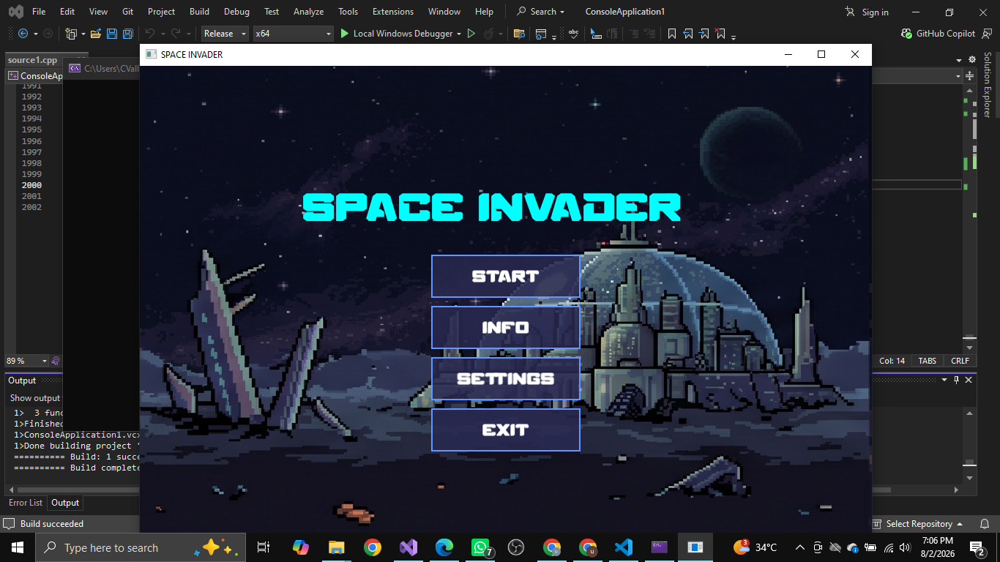
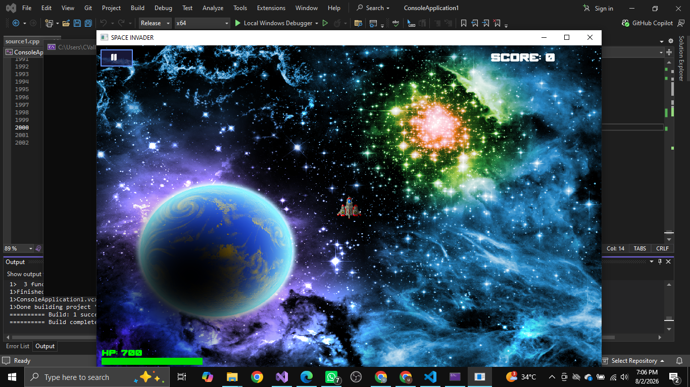
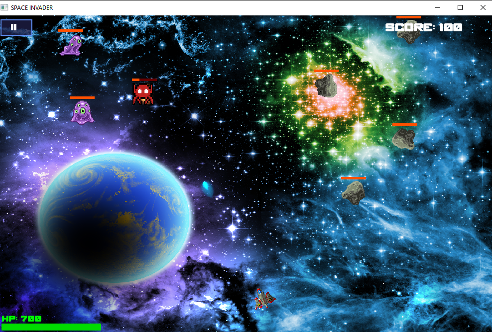
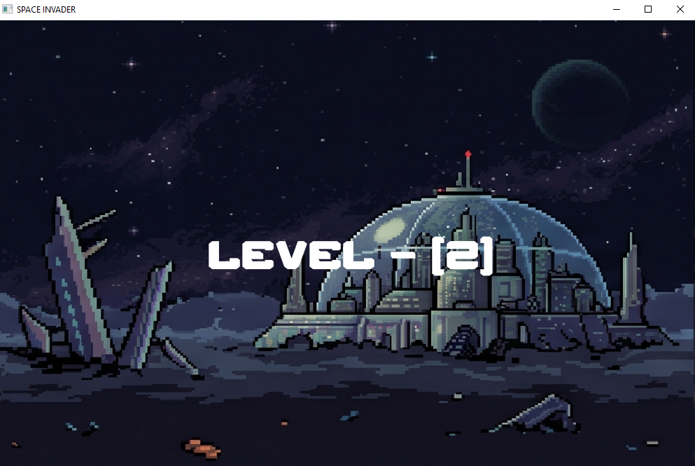
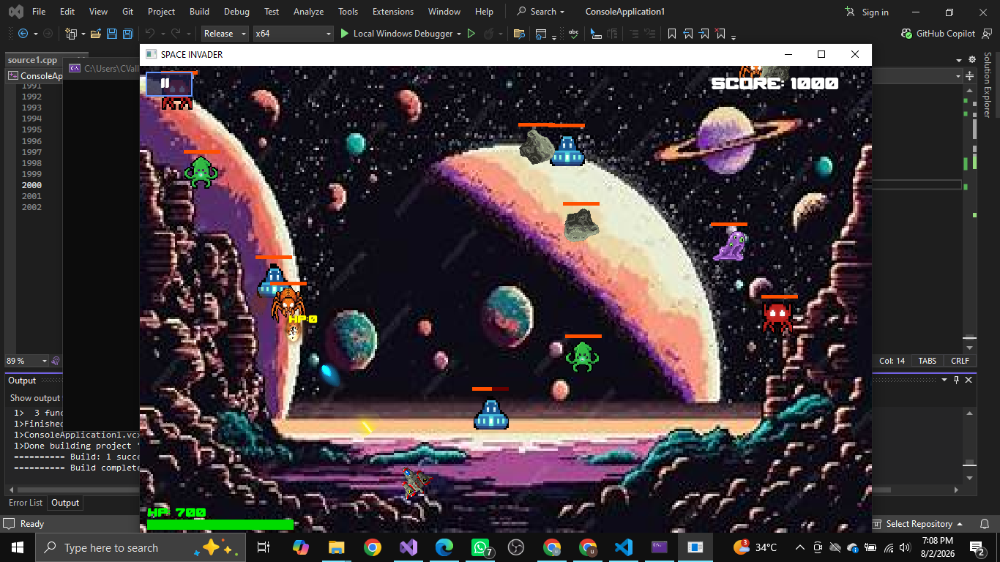
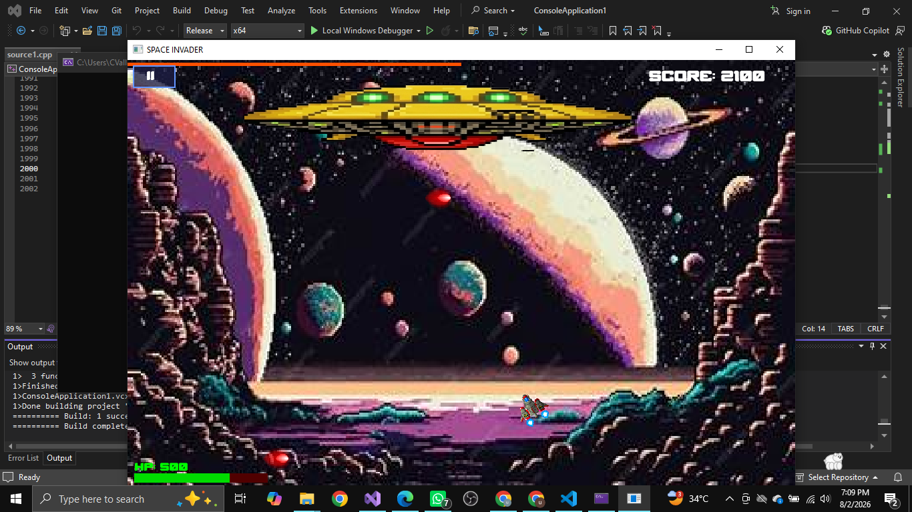
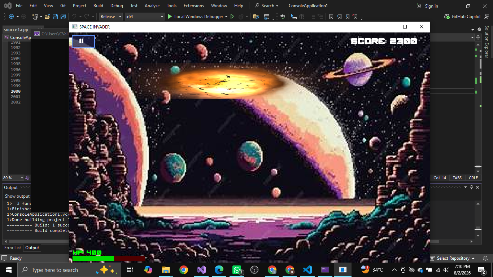
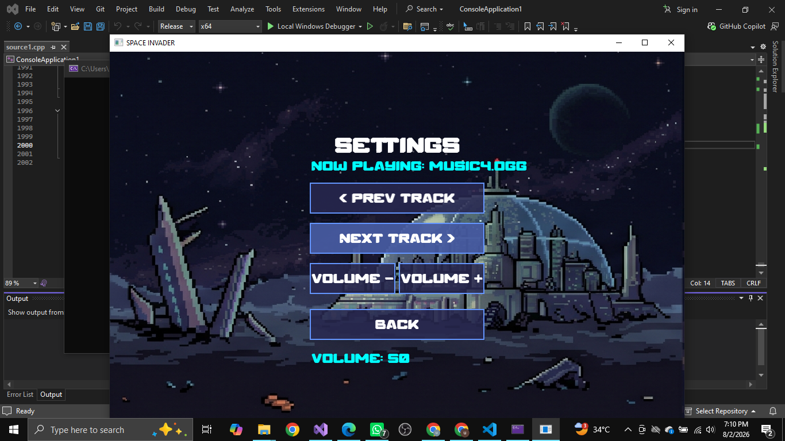

# 🚀 Space Invaders

### An enhanced take on the arcade classic, built with **C++** and **SFML**

---

## 📖 About

**Space Invaders** reimagines the timeless arcade shooter with free-roaming ship movement, dual weapon systems, multiple maps, escalating boss battles, and a full dynamic soundtrack. Pilot your ship through 3 increasingly difficult levels, dodge enemy fire, and take down a boss at the end of each level to survive.

---

## 🎮 Controls

| Key | Action |
|-----|--------|
| **W** | Boost / thrust forward |
| **A** | Turn left |
| **D** | Turn right |
| **F** | Fire blue weapon |
| **G** | Fire yellow weapon |

---

## 🖼 Screenshots

---

## ✨ Features

- 🕹 **Free ship movement** — full range of motion, not locked to a single axis
- 🔫 **Dual weapon system** — blue fire (**F**) and yellow fire (**G**), each with distinct behavior
- 👾 **3 progressively difficult levels**, each ending in a **boss battle**
- 🗺 **9 unique maps** to fight across
- 💥 **Two-way combat** — enemies fire back at the player, not just static targets
- 🎵 **Dynamic music system** — 5 background tracks, with adjustable volume (increase/decrease in-game)

---

## 🛠 Built With

- **C++** — core game logic
- **SFML** — graphics rendering, input handling, and audio playback

---

## ▶️ How to Run

1. Make sure **SFML** is installed and linked in your build environment.
2. Compile the source file with your C++ compiler, linking against SFML.
3. Run the generated executable.
4. Use **W / A / D** to move and steer your ship, **F** and **G** to fire your weapons, and fight your way through all 3 levels and their bosses.

---

## 📌 Notes

This project is part of a larger collection of C++/SFML games — check out the [main Games repository](../../) for more.