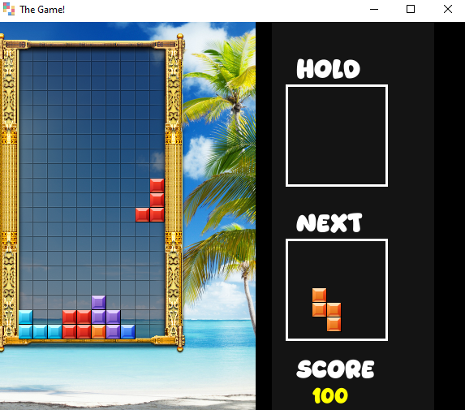
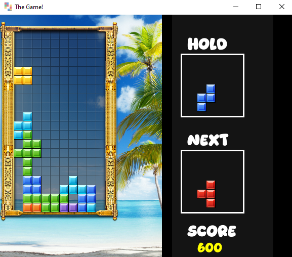

# 🧩 Tetris

### A complete implementation of the timeless puzzle classic, built with **C++** and **SFML**

---

## 📖 About

**Tetris** is a full-featured recreation of the legendary puzzle game. Stack falling pieces, clear lines, hold pieces for strategic plays, and keep an eye on what's coming next — all while racing to survive as the board fills up. Complete with background music and satisfying sound effects on every line clear.

---

## 🎮 Controls

| Key | Action |
|-----|--------|
| **↑ (Up Arrow)** | Rotate the piece |
| **↓ (Down Arrow)** | Increase falling speed |
| **← (Left Arrow)** | Move piece left |
| **→ (Right Arrow)** | Move piece right |
| **C** | Hold / release the piece |

---

## 🖼 Screenshots

---

## 🧠 Gameplay Features

- 🔮 **Next Piece Preview** — a dedicated section always shows the upcoming piece, so you can plan ahead
- 📦 **Hold System** — press **C** to store a piece for later, or swap it back into play
- 💥 **Line Clearing** — complete a horizontal row to clear it and score points
- 📈 **Scoring** — points awarded for every line cleared
- 🎵 Background music plays throughout the game
- 🔊 Dedicated sound effect triggers on every line clear

---

## ☠️ Game Over Rule

The game ends the moment a piece stacks up and **touches the top of the board** — so clearing lines efficiently is key to staying alive.

---

## 🛠 Built With

- **C++** — core game logic
- **SFML** — graphics rendering, input handling, and audio playback

---

## ▶️ How to Run

1. Make sure **SFML** is installed and linked in your build environment.
2. Compile the source file with your C++ compiler, linking against SFML.
3. Run the generated executable.
4. Use the **arrow keys** to move and rotate pieces, **C** to hold, and clear as many lines as you can before the stack reaches the top.

---

## 📌 Notes

This project is part of a larger collection of C++/SFML games — check out the [main Games repository](../../) for more.